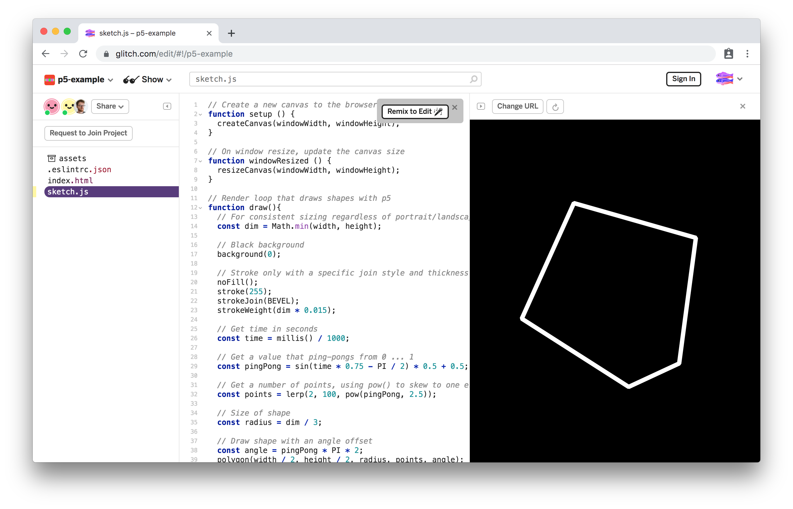

# Intro to Creative Coding

This repository includes resources & course notes for students attending my *Intro to Creative Coding* workshops, demonstrating [p5.js](https://p5js.org) and [Tone.js](https://tonejs.github.io).

The idea and layout of the demos is heavily inpsired by Mark Webster's *[Designing Programs](https://designingprograms.bitbucket.io/index.html)*.

# Contents

- ✨ Course Demos

  - 🎨 **[https://p5-demos.glitch.me](https://p5-demos.glitch.me)**

  - 🔈 **[https://tone-demos.glitch.me](https://tone-demos.glitch.me)**

- 📖 Other Material

  - *[Designing Programs](https://designingprograms.bitbucket.io/index.html)* by Mark Webster

  - *[Generative Design](http://www.generative-gestaltung.de/2/)* by Benedikt Groß

- 🔧 [Tools](#tools)

- 📦 [Sketch Templates](#sketch-templates)

- ✂️️ [Code Snippets](#code-snippets)

- ✨ [Further Reading](#further-reading)

# Tools

Here is a list of tools and libraries that will be used during the workshop.

| Tool | Documentation | Description |
|---|---|---|
| *A browser* |  | A modern browser, [Chrome](https://www.google.com/chrome/) is recommended
| [Glitch](https://glitch.com) | [Help](https://glitch.com/help/) | An online platform for editing & sharing JavaScript projects
| [p5.js](https://p5js.org) | [API Docs](https://p5js.org/reference/) | A JavaScript graphics library for creative coding
| [Tone.js](https://tonejs.github.io) | [API Docs](https://tonejs.github.io/docs/) | A JavaScript audio library for playing synths and sounds

# Sketch Templates

### 🎨 p5.js

> https://glitch.com/~p5-example

 

### 🔈 Tone.js

> ✨ https://glitch.com/~tone-example-synth

 

# Code Snippets

I've also included a small "recipes" document that you can use as a reference if you are forgetting some of the patterns and recipes discussed during the workshop.

- [Code Snippets](./docs/snippets.md)

# Further Reading

More links to generative art & creative coding:

- Books

  - *[Designing Programs](https://designingprograms.bitbucket.io/index.html)* by Mark Webster

  - *[Generative Design](http://www.generative-gestaltung.de/2/)* by Benedikt Groß

  - *[Getting Started with p5.js](https://www.amazon.com/Make-Interactive-Graphics-JavaScript-Processing/dp/1457186772)* by Lauren McCarthy

  - *[Computational Drawing Book](http://lostritto.com/book)* by Carl Lostritto

  - *[Generative Art](https://www.amazon.co.uk/Generative-Art-Matt-Pearson/dp/1935182625)* by Matt Pearson

- Videos & Courses

  - [The Coding Train](https://thecodingtrain.com) with Daniel Shiffman

  - [Creative Coding with Canvas & WebGL](https://frontendmasters.com/courses/canvas-webgl/) — My own course

- Generative Art

  - [Generative Artistry](https://generativeartistry.com/) — Tutorials & Podcast

  - [Anders Hoff](https://inconvergent.net/#writing) — Writing on Generative Art

  - [Tyler Hobbs](http://www.tylerlhobbs.com/writings) — Writing on Generative Art

  - [My Blog](https://mattdesl.svbtle.com/) — Writing on Creative Coding & Generative Art

- Math

  - [Linear Interpolation](https://mattdesl.svbtle.com/linear-interpolation) — Introduction to `lerp`

  - [math-as-code](https://github.com/Jam3/math-as-code) — A cheat sheet for mathematical notation in code form

- Audio

  - [Learning Synths by Ableton](https://learningsynths.ableton.com/)

  - [Learning Music by Ableton](https://learningmusic.ableton.com/index.html)

  - [Music Theory](https://www.lightnote.co/)

- Related Art Books & Zines

  - [Circle, Square, Triangle](https://www.counter-print.co.uk/products/bruno-munari-circle-square-triangle) by Bruno Munari

  - [The ABCs of Triangle, Square, Circle: The Bauhaus and Design Theory](https://www.counter-print.co.uk/products/the-abcs-of-triangle-square-circle-the-bauhaus-and-design-theory) by Ellen Lupton

  - [Graphic Design Manual: Principles and Practice](https://www.counter-print.co.uk/products/graphic-design-manual) by Armin Hofmann

  - [Analog Algorithm](https://www.counter-print.co.uk/products/analog-algorithm) by Christoph Grünberger

  - [Market Cafe Magazine](https://www.marketcafemag.com/)

- Communities

  - [Open Processing](https://www.openprocessing.org/browse/#)

  - [creative-dev Slack team](https://creative-dev.herokuapp.com/)

  - [#plottertwitter](https://twitter.com/hashtag/plottertwitter?lang=en), [#generative](https://twitter.com/hashtag/generative?lang=en), [#webgl](https://twitter.com/hashtag/webgl?lang=en) and similar hashtags on Twitter, Instagram etc.

- More Tools

  - [canvas-sketch](https://github.com/mattdesl/canvas-sketch) — A framework for creative coding and generative art in JavaScript

- More Resources

  - [awesome-creative-coding](https://github.com/terkelg/awesome-creative-coding) — A large list of resources

# License

MIT, see [LICENSE.md](./LICENSE.md) for details.