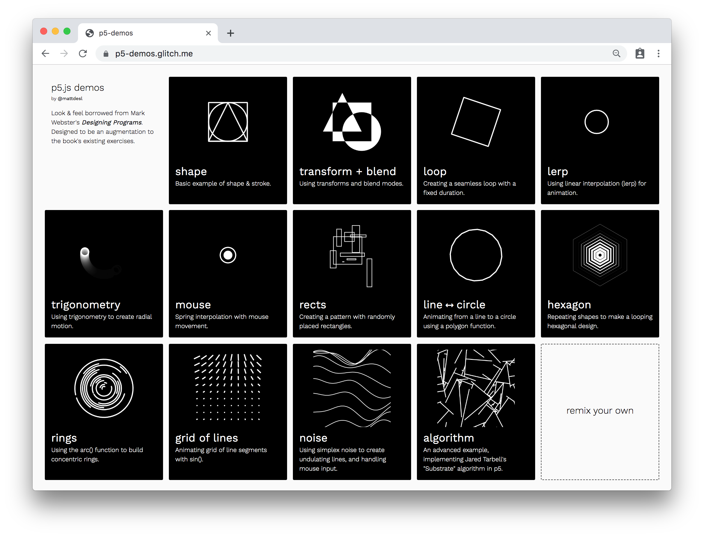

# Intro to Creative Coding

This repository includes resources & course notes for students attending my *Intro to Creative Coding* workshops, demonstrating [p5.js](https://p5js.org) and [Tone.js](https://tonejs.github.io).

The idea and layout of the demos is heavily inpsired by Mark Webster's *[Designing Programs](https://designingprograms.bitbucket.io/index.html)*.

# Contents

- ✨ [Course Demos](#course-demos)

- ✏️ [Exercises](#exercises)

- 🔧 [Tools](#tools)

- ✂️️ [Code Snippets](#code-snippets)

- 📖 [Slides](#slides)

- ✨ [Further Reading](#further-reading)

# Course Demos

- ✨ **[starter demo](https://glitch.com/edit/#!/p5-easy-start?path=sketch.js%3A19%3A14)** — a bare-bones starter demo

  - You can also find a [similar demo on CodeSandbox](https://codesandbox.io/s/p5-template-woe6w?file=/sketch.js) if Glitch.com is giving you any trouble

- 🔥 **[p5 random walker](https://glitch.com/edit/#!/p5-demo-walk?path=sketch.js%3A62%3A1)** — a simple generative art sketch with p5.js

- 📚 Collections

  - 🎨 **[p5-demos.glitch.me](https://p5-demos.glitch.me)** — examples with p5.js

  - 🔈 **[tone-demos.glitch.me](https://tone-demos.glitch.me)** — examples with Tone.js

## Exercises

- ✏️ [Warm-Up Drawing Exercise](./exercises/1-drawing.md)

- ✏️ [Georg Nees Remix](./exercises/2-georg-nees.md)

- ✏️ [Hard-Edge Painting](./exercises/3-painting.md)

# Tools

Here is a list of tools and libraries that will be used during the workshop.

| Tool | Documentation | Version | Description |
|---|---|---|---|
| *A browser* |  |  | A modern browser, [Chrome](https://www.google.com/chrome/) is recommended
| [Glitch](https://glitch.com) | [Help](https://glitch.com/help/) |  | An online platform for editing & sharing JavaScript projects
| [p5.js](https://p5js.org) | [API Docs](https://p5js.org/reference/) | [0.9.0](https://cdnjs.cloudflare.com/ajax/libs/p5.js/0.9.0/p5.min.js) | A JavaScript graphics library for creative coding
| [Tone.js](https://tonejs.github.io) | [API Docs](https://tonejs.github.io/docs/) | [13.8.25](https://unpkg.com/tone@13.8.25/build/Tone.js) | A JavaScript audio library for playing synths and sounds

# Just Starting Out

If you've never coded before, you can check out this tutorial that explains some of the basics:

- [JavaScript For Cats](http://jsforcats.com/)

Also great is Daniel Shiffman's video series, which often uses p5.js:

- [Programming from A to Z](https://shiffman.net/a2z/)

A more comprehensive guide on the JavaScript language can be found here:

- [The Modern JavaScript Tutorial](https://javascript.info/)
- [Learn JavaScript in Detail](https://www.scaler.com/topics/javascript/)

And here's a useful cheat sheet to use as a reference:

- [Interactive JavaScript Cheat Sheet](https://htmlcheatsheet.com/js/)

# Code Snippets

I've also included a small "recipes" document that you can use as a reference if you are forgetting some of the patterns and recipes discussed during the workshop.

- [Code Snippets](./docs/snippets.md)

- [How-To: Functions](./docs/functions.md)

- [How-To: Timers](./docs/timers.md)

# Further Reading

More links to generative art & creative coding:

- Books

  - *[Designing Programs](https://designingprograms.bitbucket.io/index.html)* by Mark Webster

  - *[Generative Design](http://www.generative-gestaltung.de/2/)* by Benedikt Groß

  - *[Getting Started with p5.js](https://www.amazon.com/Make-Interactive-Graphics-JavaScript-Processing/dp/1457186772)* by Lauren McCarthy

  - *[Computational Drawing Book](http://lostritto.com/book)* by Carl Lostritto

  - *[Generative Art](https://www.amazon.co.uk/Generative-Art-Matt-Pearson/dp/1935182625)* by Matt Pearson

- Videos & Courses

  - [The Coding Train](https://thecodingtrain.com) with Daniel Shiffman

  - [Creative Coding with Canvas & WebGL](https://frontendmasters.com/courses/canvas-webgl/) — My own course

- Generative Art

  - [Generative Artistry](https://generativeartistry.com/) — Tutorials & Podcast

  - [Anders Hoff](https://inconvergent.net/#writing) — Writing on Generative Art

  - [Tyler Hobbs](http://www.tylerlhobbs.com/writings) — Writing on Generative Art

  - [My Blog](https://mattdesl.svbtle.com/) — Writing on Creative Coding & Generative Art

- Math

  - [Sine / Cosine Reference](https://www.mathsisfun.com/algebra/trig-interactive-unit-circle.html)

  - [Sine and Cosine Calculator](https://www.desmos.com/calculator/hlqxvc6hho)

  - [Linear Interpolation](https://mattdesl.svbtle.com/linear-interpolation) — Introduction to `lerp`

  - [math-as-code](https://github.com/Jam3/math-as-code) — A cheat sheet for mathematical notation in code form

- Audio

  - [Learning Synths by Ableton](https://learningsynths.ableton.com/)

  - [Learning Music by Ableton](https://learningmusic.ableton.com/index.html)

  - [Music Theory](https://www.lightnote.co/)

- Related Art Books & Zines

  - [Circle, Square, Triangle](https://www.counter-print.co.uk/products/bruno-munari-circle-square-triangle) by Bruno Munari

  - [The ABCs of Triangle, Square, Circle: The Bauhaus and Design Theory](https://www.counter-print.co.uk/products/the-abcs-of-triangle-square-circle-the-bauhaus-and-design-theory) by Ellen Lupton

  - [Graphic Design Manual: Principles and Practice](https://www.counter-print.co.uk/products/graphic-design-manual) by Armin Hofmann

  - [Analog Algorithm](https://www.counter-print.co.uk/products/analog-algorithm) by Christoph Grünberger

  - [Market Cafe Magazine](https://www.marketcafemag.com/)

- Communities

  - [Open Processing](https://www.openprocessing.org/browse/#)

  - [creative-dev Slack team](https://creative-dev.herokuapp.com/)

  - [#plottertwitter](https://twitter.com/hashtag/plottertwitter?lang=en), [#generative](https://twitter.com/hashtag/generative?lang=en), [#webgl](https://twitter.com/hashtag/webgl?lang=en) and similar hashtags on Twitter, Instagram etc.

- More Tools

  - [canvas-sketch](https://github.com/mattdesl/canvas-sketch) — A framework for creative coding and generative art in JavaScript

  - [Spectrum Analyser](http://spectrum.surge.sh/) — see the frequency spectrum of an MP3 file

- More Resources

  - [awesome-creative-coding](https://github.com/terkelg/awesome-creative-coding) — A large list of resources

# License

MIT, see [LICENSE.md](./LICENSE.md) for details.
