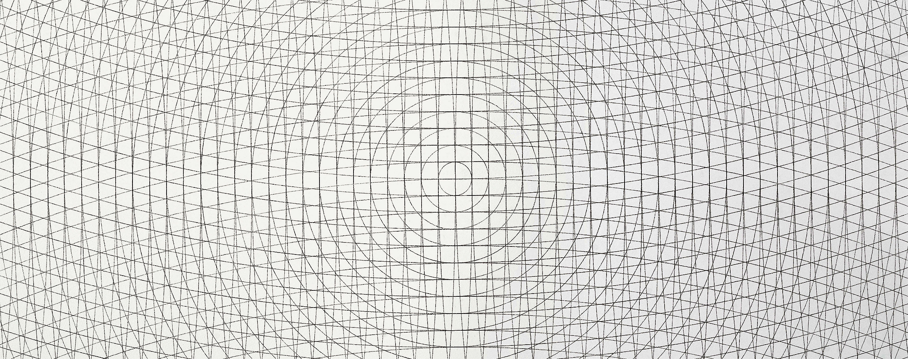
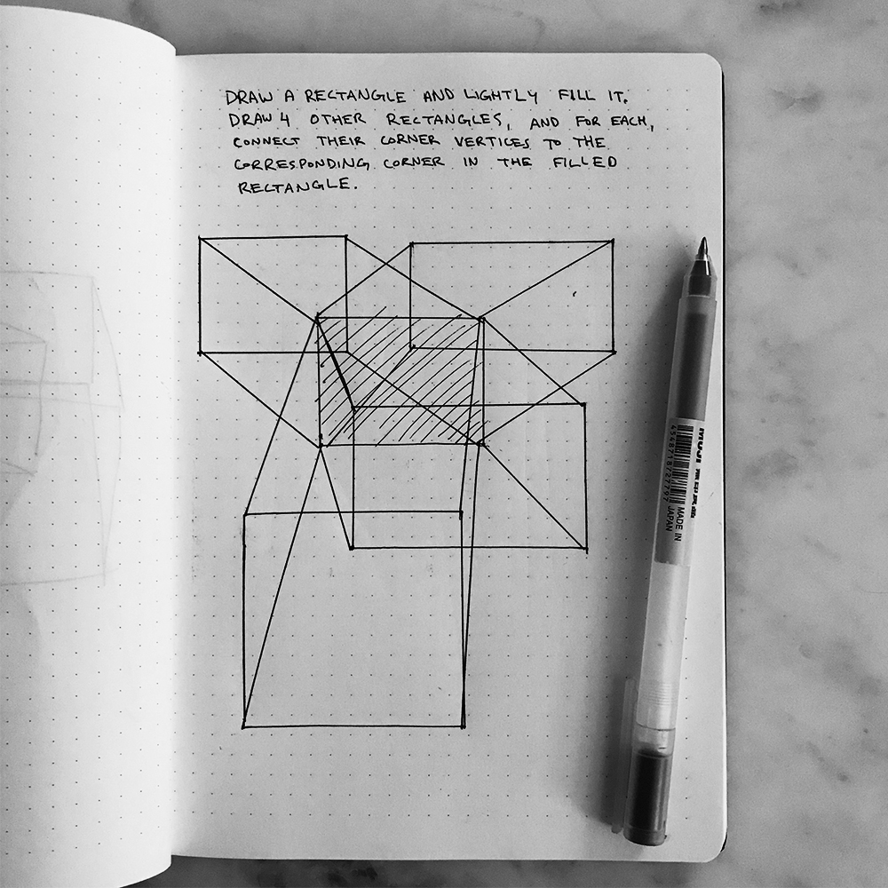

#### :closed_book: [Intro to Creative Coding](../README.md) → Warm-Up Drawing Exercise

---

# ✏️ Warm-Up Drawing Exercise

Let's find some inspiration in the works of Sol LeWitt and try to do a warm-up drawing exercise.

With pen and pencil, come up with a short set of instructions that produces some graphic output. Keep it simple and minimal, and try to stick with basic shapes and forms like lines, circles, points, squares, etc.

#### 📚 References

- [Sol LeWitt](http://www.artnet.com/artists/sol-lewitt/)

  - Also see [SolvingSol.com](<[SolvingSol.com](https://solvingsol.com/solutions/)>)

- [Leslie Roberts](http://www.paintingisdead.com/leslie-roberts.html)

- [Dear Data](http://www.dear-data.com/)

### 🚀 Example 1: Wall Drawing #130

One classic example is _"Grid and arcs from four corners"_, Sol LeWitt's instructions for Wall Drawing #130 in 1972. The rendered artwork looks something like this:

### 🚀 Example 2: Subdivision

_"Divide an area in two. Choose one of the two new rectangles, and repeat."_

### 🚀 Example 3: Connected Rectangles

1. _Draw a rectangle on the page and lightly fill it._
2. _Draw 4 other rectangles around the page, and for each, connect their corners to the corresponding corner in the filled rectangle._

### Having Trouble?

If you're stuck, try recreating one of Sol LeWitt's artworks. You can find some DIY recreations along with LeWitt's instructions on [SolvingSol.com](https://solvingsol.com/solutions/).

### :bulb: Bonus!

If you have a friend, family member, or colleague nearby, give them the same instructions to see what they draw and how it might turn out differently!

##

#### [← Back to README](../README.md)
