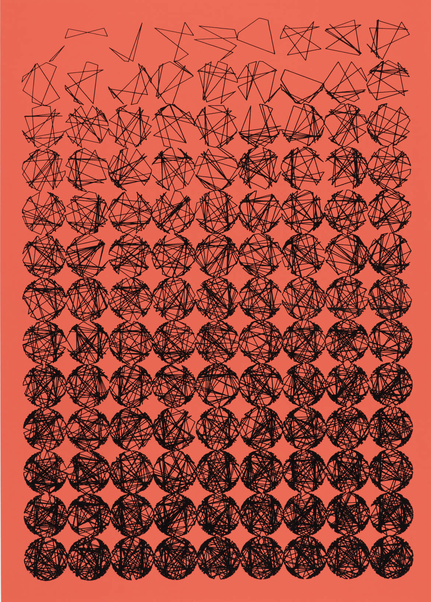
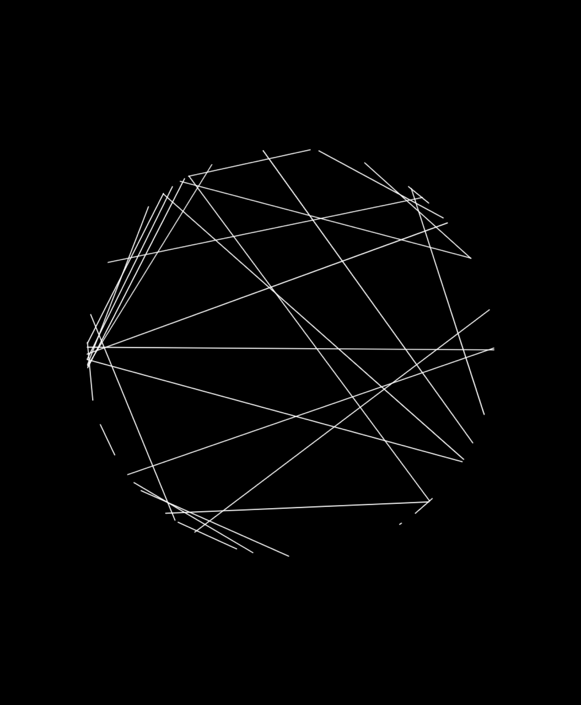
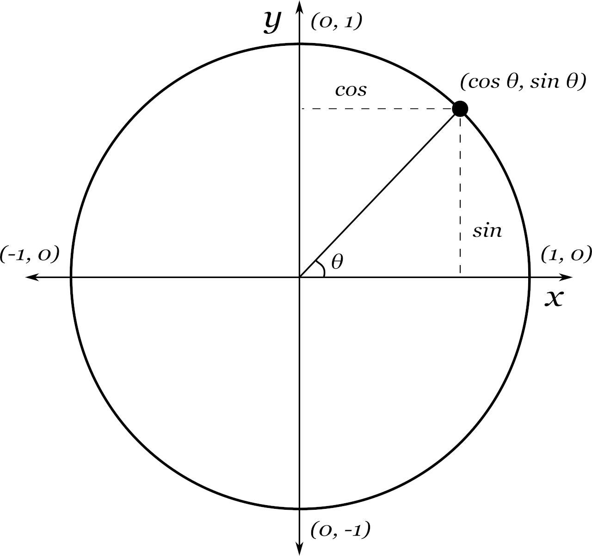

#### <sup>:closed_book: [Intro to Creative Coding](../README.md) → Remixing Georg Nees</sup>

---

# ✏️ Remixing Georg Nees

In this challenge we will remix a classic untitled artwork from Georg Nees', created in 1970 with early computer software.



In code:

```js
line(x1, y1, x2, y2);
```

### Line Segments

The work is based on many `line()` segments that are drawn iteratively. Each segment is a straight line from one random point on a circle to another random point on the circle.



### Static Configuration

Since we are drawing just a single static frame (image), we don't need an animation loop. We can also define a fixed random seed if desired, and we can change this when we want to produce a new graphic.

```js
noLoop(); // disable animation
randomSeed("12345"); // can be any string

// setup colors
stroke("black");
noFill();
```

### For Loops

We will use a for loop to draw many shapes iteratively, one after another.

```js
// number of times to repeat
const count = 10;

// run the loop
for (let i = 0; i < count; i++) {
  // ... draw something inside the loop ...
  line(0, 0, width, random(0, height));
}
```

### Points on a Circle

We need to use a little math (trigonometry) to achieve this. We need to compute two different points on a circle, and we can use `cos()` and `sin()` on an angle to get the `x` and `y` coordinate, respectively:



So, we will choose a random angle in the range `[-PI..PI]`:

```js
theta = random(-PI, PI);
```

Then we use trigonometry to determine the offset from the circle center (origin point). This will give us a _unit circle_ (here _unit_ indicates that its radius is 1). We can use the variable name _u_ and _v_ as these are often used to describe values in the range `[-1..1]`.

```js
u = cos(theta);
v = sin(theta);
```

Now we can compute the final position with desired circle radius _r_ and offset `(cx, cy)` (the origin point of the circle).

```js
x = cx + u * r;
y = cy + v * r;
```

This is also the basis for polar coordinate systems, where you use `(theta, r)` to determine a point in space rather than `(x, y)`.

### Transform

Something we can do instead of offsetting each point by `(cx, cy)` is to translate the entire drawing context with. It looks like so:

```js
// choose an origin, such as the center of page
cx = width / 2;
cy = height / 2;

// translate new origin to this coordinate
translate(cx, cy);

// now everything is drawn from that new origin
// we can draw a small circle to test this out
circle(u * r, v * r, 10);

// don't forget to reverse the transaction once you are done
translate(-cx, -cy);
```

## ✨ Solution

Click [here](https://glitch.com/edit/#!/georg-nees-remix-01?path=sketch.js%3A44%3A6) to see the coded solution to this exercise.

#### 📚 References

- [Unit Circle: Sine and Cosine Functions](https://www.coursehero.com/study-guides/precalctwo/unit-circle-sine-and-cosine-functions/)

##

#### <sup>[← Back to README](../README.md)
