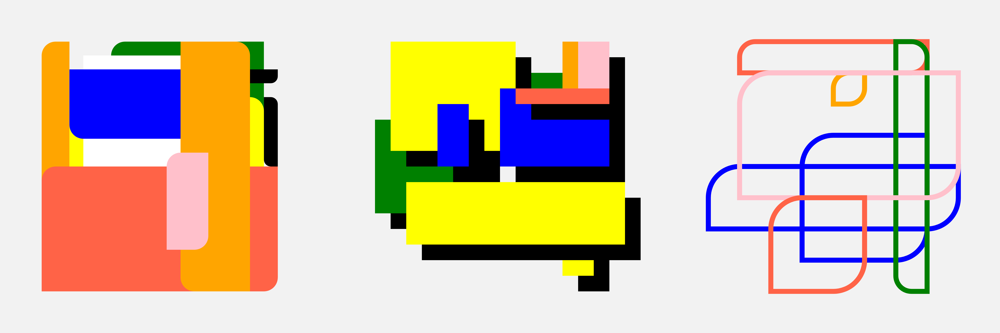

#### :closed_book: [Intro to Creative Coding](../README.md) → Hard Edge Painting

---

# ✏️ Hard Edge Painting

This is a simple sketch that draws rectangles of different size across the surface, inspired by Ellsworth Kelly and Hiroshi Kawano.

Some things to note:

- The `seed` is chosen randomly at setup, and used in each render.

- We use `noLoop` to avoid animation

- We use `CORNERS` mode to render the rectangles at random positions and sizes

- We fix the canvas size to a specific pixel size, for high quality print output

#### 🚀 Things to Try

- Try to experiment with the corner size, maybe randomizing it, and even randomizing each corner radius differently.
- Try to draw the image in two passes: one with fill, and one with stroke.
- Try to use a different color palette or procedural color selection.
- Try to use a "drop shadow" by first drawing the shape with an offset in black.

## ✨ Solution

Click [here](https://glitch.com/edit/#!/hard-edge-paintings) to see the coded solution to this exercise.

#### 📚 References

- Ellsworth Kelly

- Bauhaus Design

- Hiroshi Kawano

#### [← Back to README](../README.md)
